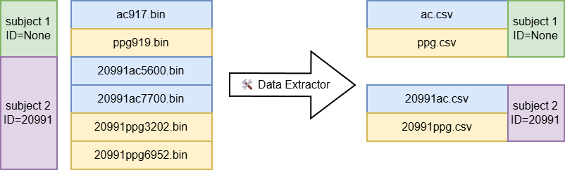

# Data Extraction Feature

## Overview

The **Data Extraction** feature in **YAMS** is designed to convert raw binary sensor data into a human-readable CSV format. This tool simplifies the process of working with physiological (PPG) and motion (IMU) data by extracting and organizing them by subject.

## How It Works

The data extraction tool takes raw binary files as input and processes them into structured CSV files. Each subject’s PPG and IMU data are parsed separately. 

## How to Use

1. Open **YAMS**.
2. Navigate to the **🛠️ Data Extractor** tab.
3. In the **Input directory** field, specify the folder containing the raw binary files.
4. In the **Output directory** field, specify where the extracted CSV files should be saved.
5. (Uncommon) Check "legacy sampling rate" box if the data was collected on a older firmware version. Do NOT check this box if using firmware >- 4.5.3.
6. Once all fields are completed, click the **Extract raw data** button to begin the process.

## Expected Input Structure

The input folder should contain raw binary files with filenames in the following format:

- `<subject_id>ppg<reference_timestamp>.bin` – for PPG data
- `<subject_id>ac<reference_timestamp>.bin` – for IMU (accelerometer) data

Each filename encodes the **subject ID** and a **reference timestamp**, which the extractor uses to group data accordingly. It is untypical but in some cases, **subject ID** can be empty. 

## Output Format

The extractor generates one CSV file for each type of data per subject:

- For each unique `<subject_id>` in the input folder:
  - One **PPG** CSV file
  - One **Accelerometer** CSV file

### IMU csv data format

`<subject_id>ac.csv`

| Header    | Description                                                              | Unit             |
|-----------|--------------------------------------------------------------------------|------------------|
| `AccX`      | Accelerometer X-axis                                                     | `g`            |
| `AccY`      | Accelerometer Y-axis                                                     | `g`            |
| `AccZ`      | Accelerometer Z-axis                                                     | `g`            |
| `GyroX`     | Gyroscope X-axis                                                         | `float32`          |
| `GyroY`     | Gyroscope Y-axis                                                         | `float32`          |
| `GyroZ`     | Gyroscope Z-axis                                                         | `float32`          |
| `ENMO`      | Euclidean Norm Minus One                                                 | `n/a `             |
| `Timestamp` | (Reserved) Reference timestamp - for generic use please refer to CDCT    | `uint32`           |
| `Counter`   | (Reserved) Package counter                                                | `uint16`           |
| `CDCT`      | Calculated data collection time - time when the data is collected in UTC | `sec`              |
| `Datetime`  | Human readable date time in UTC                                          | `MM/DD/YYYY HH:MM` |

### PPG csv data format

`<subject_id>ppg.csv`

| Header    | Description                                                              | Unit             |
|-----------|--------------------------------------------------------------------------|------------------|
| `ir1`       | Infrared light #1                                                        | `uint32`           |
| `ir2`       | Infrared light #2                                                        | `uint32`           |
| `g1`        | Green light #1                                                           | `uint32`           |
| `g2`        | Green light #2                                                           | `uint32`           |
| `Timestamp` | (Reserved) Reference timestamp - for generic use please refer to CDCT    | `uint32`           |
| `Counter`   | (Reserved) Package counter                                                | `uint16`           |
| `CDCT`      | Calculated data collection time - time when the data is collected in UTC | `sec`              |
| `Datetime`  | Human readable date time in UTC                                          | `MM/DD/YYYY HH:MM` |

## Command line usage

Most common (e.g., firmware >= 4.5)

- `python -m yams.data_extraction -i <path/to/binary/data> -o <path/to/output>` 

Not common. For firmware with 25 Hz sampling rate

- `python -m yams.data_extraction -i <path/to/binary/data> -o <path/to/output> --legacy_fs` 