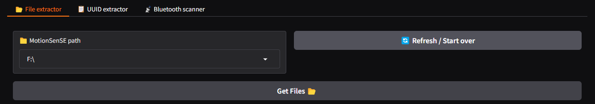
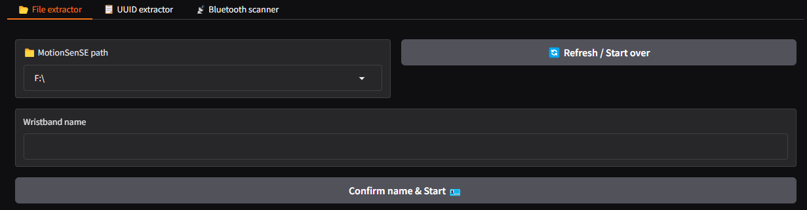
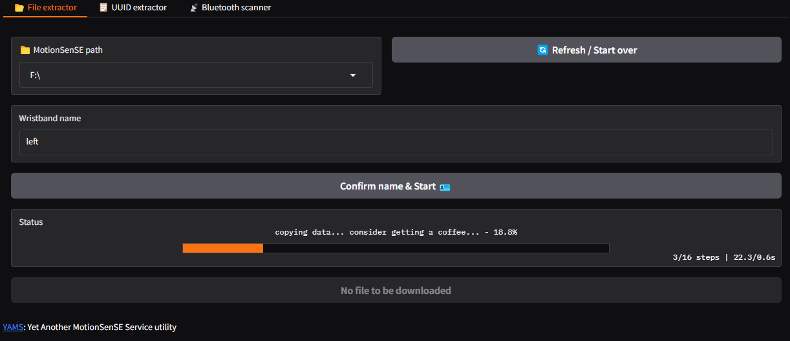
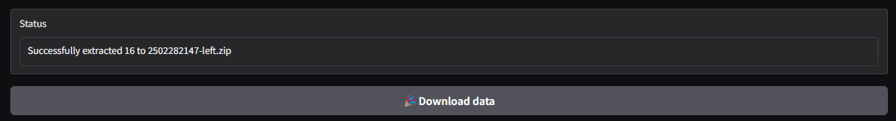

# Extract collected data from MotionSenSE device

This document provides a user guide to extract onboard data collected from MotionSenSE devices.

## Step 1: Preparation 

1. Connect MotionSenSE device to computer via a micro-USB cable. 
2. Launch YAMS and navigate to file extractor tab

## Step 2: Extracting files

1. Press `🔄 Refresh / Start over` button to automatically identify any attached MotionSenSE storage
    - if multiple devices are attached, use the drop down menu to select the desired storage path

2. Press `Get Files 📂` button to open up `Wristband name` text box

3. Enter device name under `Wristband name`. Note: this filed cannot be left blank
4. Press `Confirm name & Start 🪪` to start extracting data. 
    - the process may take a while to complete if multiple data files are presented

5. Once completed, a message similar to "Successfully extracted ..." will appear in status page, and the bottom button will illuminated showing `🎉Download data`. 

6. Press `🎉Download data` button to download the extracted data

7. Repeat the part for all wristband sensors